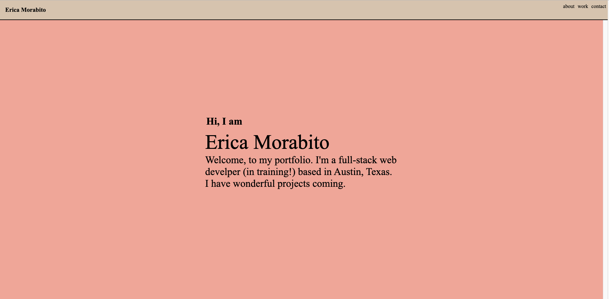
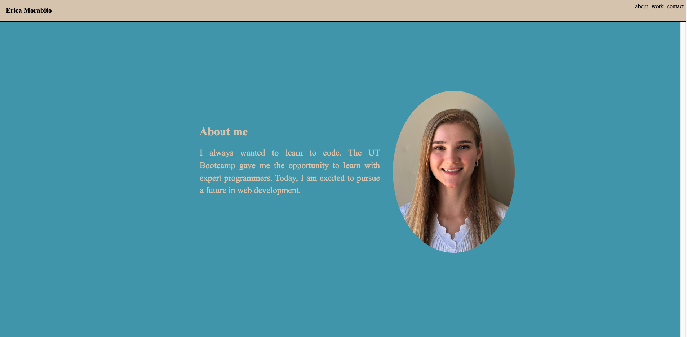
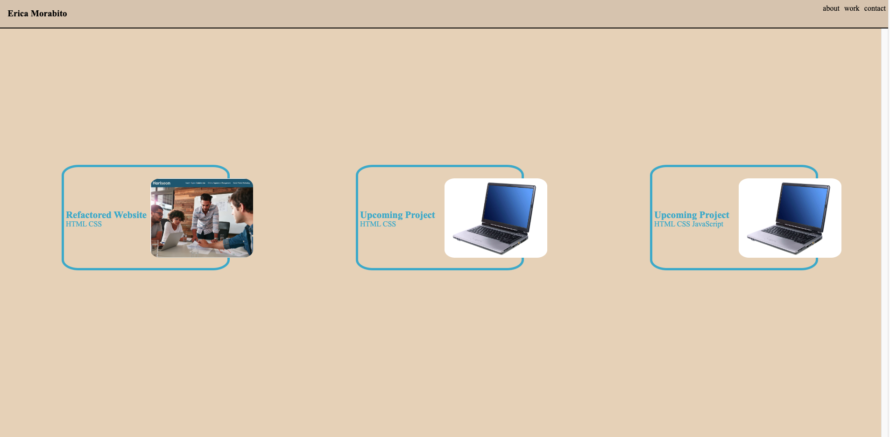

# Erica Morabito's Portfolio Site

## Description

- My motivation for this website is to showcase my projects and work samples for employers.
- I built this project to house my work in one location to simplify an employer's assessment process.
- This site gives employers a greater understanding of my web development skills.
- Throughout this project, I grew my understanding of HTML, CSS, and responsive design.

## Installation

- Open your chosen browser.
- Copy this URL: 
- Paste into browser.
- View webpage home and navigation bar.

**Webpage Home**

## Usage

**To learn more about me:**
- Follow installation instructions.
- Click "about" at the top of the webpage.
- View "about" information.

**To view my work:**
- Follow installation instructions.
- Click "work" at the top of the webpage.
- Click on the image associated with each project.
- View deployed website.

**To contact me:**
- Followinstallation instructions.
- Click "contact" at the top of the webpage.
- Call, text or email me using the contact information listed at the bottom of the webpage.

## Credits

**Portfolios I took inspiration from:**
- https://brittanychiang.com/
- https://bepatrickdavid.com/

**Tutorials I used:**
- https://www.youtube.com/watch?v=y9nlfqT4s9s
---
